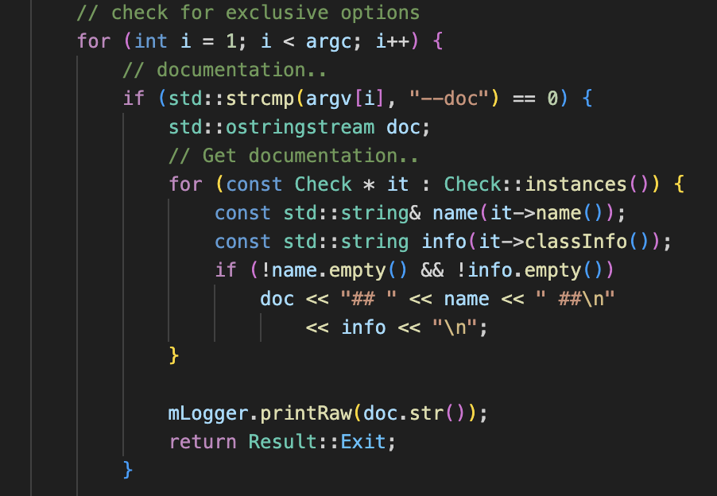

# Learn C++ with Real World Project (Cppcheck)

## Static Initialization in C++

### Just something random

I recently started reading the source code of [Cppcheck](https://github.com/danmar/cppcheck). So I am thinking why I am not writing 
a series on the things I learned during reading the source code. It helps me keeps these stuff in my mind longer (hopefully!).

As a beginner to open source projects, I feel it is too hard for me to transit from the textbook of C++ to real world projects. There
is a huge gap between a toy program of 100 lines of code in a textbook and even a small open source proects with a few thousand lines
of code. In addition to different C++ techniques and extensive use of macros, a developer should also know CMake to get a deep 
understanding of how different executables and libraries are built. Online forums are good places to learn knowledges about C++, but
they do not help too much without a developer knows what to ask. So, I am writing this series of posts to keep record how I come with
questions to ask. Each post will consists of something I learned by 

1. Reading the source code.
2. Finding something I do not understand.
3. Ask questions online.
4. Answers and summary.

Hope these posts are useful to someone in the future as I proofread my text. But at least it would be fun for me to read these posts in
a few years.


### Strange Behavior of Cppcheck.

So when I start to read the source code of Cppcheck, I notice that there is an option "--doc" that does not have too much comments.

||

The code itself is pretty simple, and it seems like the option "--doc" is to output some documentation of the checks run by Cppcheck.
But when I check the inner for loop, the `Check::instances()` part catchs my attention. Under the hood, the function is a static function that returns a static variables `_instances` which is just defined by the function itself.

```c++
std::list<Check *> &Check::instances()
{
#ifdef __SVR4
    // Under Solaris, destructors are called in wrong order which causes a segmentation fault.
    // This fix ensures pointer remains valid and reachable until program terminates.
    static std::list<Check *> *_instances= new std::list<Check *>;
    return *_instances;
#else
    static std::list<Check *> _instances;
    std::cout << _instances.size() << "\n";
    return _instances;
#endif
}
```

Since the call to `Check::instances()` is one of the few firs t steps after the main function, I am expecting it has no instances being created at this moment, and thus no output! However, the actual output is pretty long though.

```
## 64-bit portability ##
Check if there is 64-bit portability issues:
- assign address to/from int/long
- casting address from/to integer when returning from function

## Assert ##
Warn if there are side effects in assert statements (since this cause different behaviour in debug/release builds).

## Auto Variables ##
A pointer to a variable is only valid as long as the variable is in scope.
Check:
- returning a pointer to auto or temporary variable
- assigning address of an variable to an effective parameter of a function
- returning reference to local/temporary variable
- returning address of function parameter
- suspicious assignment of pointer argument
- useless assignment of function argument

...

```


So I start to ask myself when and where does the variable `_instances` is being modified. I do not see any modification to `_instances` anywhere else and a quick `grep` confirms my thoughts. So I started looking the use of `instances()` instead but only end up with some usage with in the construction of class `Check`

```c++
Check::Check(const std::string &aname)
    : mName(aname)
{
    {
        const auto it = std::find_if(instances().begin(), instances().end(), [&](const Check *i) {
            return i->name() == aname;
        });
        if (it != instances().end())
            throw std::runtime_error("'" + aname + "' instance already exists");
    }

    // make sure the instances are sorted
    const auto it = std::find_if(instances().begin(), instances().end(), [&](const Check* i) {
        return i->name() > aname;
    });
    if (it == instances().end())
        instances().push_back(this);
    else
        instances().insert(it, this);
}
```

So, here it is. It is the constrcutor that modifies the `_instances` variable. But that does not answer my whole question. My next question is why the constructor is called even there is no explicit call to `Check::Check(...)`. I know my best chances are there are some classes that inherit `Check` and they construct some objects before the call. However, I also do not see any explicit call to any constructors. So exactly where is that `Check::Check(...)` is called becomes my question now.

To make sure I do not miss any construtors before the call to static function `instances`, I output the size of `_instances` right after the program starts the main function. However, the variable `_instances` is already being populated even at this moment. So, definitely something I do not know is going on before the program start execution from main.

The first idea that comes to me is that maybe Cppcheck uses some magic code that the system will automatic loads and executes them before the main function. But after searching answers for a while, no luck for me. Then I come across at a question on stackoverflow. 

[When are static C++ class members initialized?](https://stackoverflow.com/questions/1421671/when-are-static-c-class-members-initialized)

Although not exactly the answer I am looking for, but it definitely gives me a direction to look at. According to the answers of the question, the static class members in C++ are initialized before the main function. So, if the static variable also follows this rule, then it is likely that there is a static variable somewhere in the source code, and that variable has type that subclasses `Check`. In that case, initializing that object will call its constructor, and in turn calls the constructor of `Check`, which updates the `_instances`.

This idea is confirmed by this question [When are static and global variables initialized?](https://stackoverflow.com/questions/17783210/when-are-static-and-global-variables-initialized). From the answers, we know that global variables and static variables in C++ all have `static store class`, and they will all be initialized before the main function. Specifically, there are static initialization and dynamic initialization for objects with `static store class`. Obviously, our case is the dynamic initialization.

The static initializations always happens before dynamic initializations. And in this question [c++ initialization static variable in "local scope"](https://stackoverflow.com/questions/60122603/c-initialization-static-variable-in-local-scope), it brings up a really interesting issue that the when a local static variable will be initialized. The answer is it will be initialized at the first time it being used. This is actually important to our question and we will go back to it later. Actually, it is a common technique used to resolve static initialization order problem. See [How do I prevent the “static initialization order problem”?](https://isocpp.org/wiki/faq/ctors#static-init-order-on-first-use) and [Why doesn’t the Construct On First Use Idiom use a static object instead of a static pointer?](https://isocpp.org/wiki/faq/ctors#construct-on-first-use-v2).

Okay. So now we have figured out it is a variable with static storage class that makes insidiously before the main function. Let's confirm it and find thet bad static variable. According to the output of the option "--doc", class `CheckVaarg` is definite one of the classes that inherits `Check`. However, a quick `grep` on pattern `static CheckVaarg` returns nothing.

Wait, what? Does it mean I am thinking the whole thing wrong? After a thorough exam of the `checkvaarg.cpp` file, these lines catch my attention.

```c++
namespace {
    CheckVaarg instance;
}
```

So, there is a `CheckVaarg` object, but why it is not a static one? The answer lies in one of the previous question, saying that a global variable also has static storage class. However, why is here an anonymous namespace? This question [Why an unnamed namespace is a "superior" alternative to static?](https://stackoverflow.com/questions/4977252/why-an-unnamed-namespace-is-a-superior-alternative-to-static) answers my question. And it turns out that defining a variable in an anonymous namespace is a superior way of defining a static file scope variable. So, the `CheckVaarg` object `instance` has static storage class, and its constructor will be called before the main function.

FINALLY!!! We figured it out! Let's summarize the whole stuff again. In C++, variables with static storage class will be initialized before the main function. Cppcheck takes advantage of this attribute to register different checks in the program. Cppcheck defines objects in anonymous namespace to make these unique check objects avaiable even before the main function starts to run.

That's it! We have made this far from a simple question. I hope you enjoy this post.


