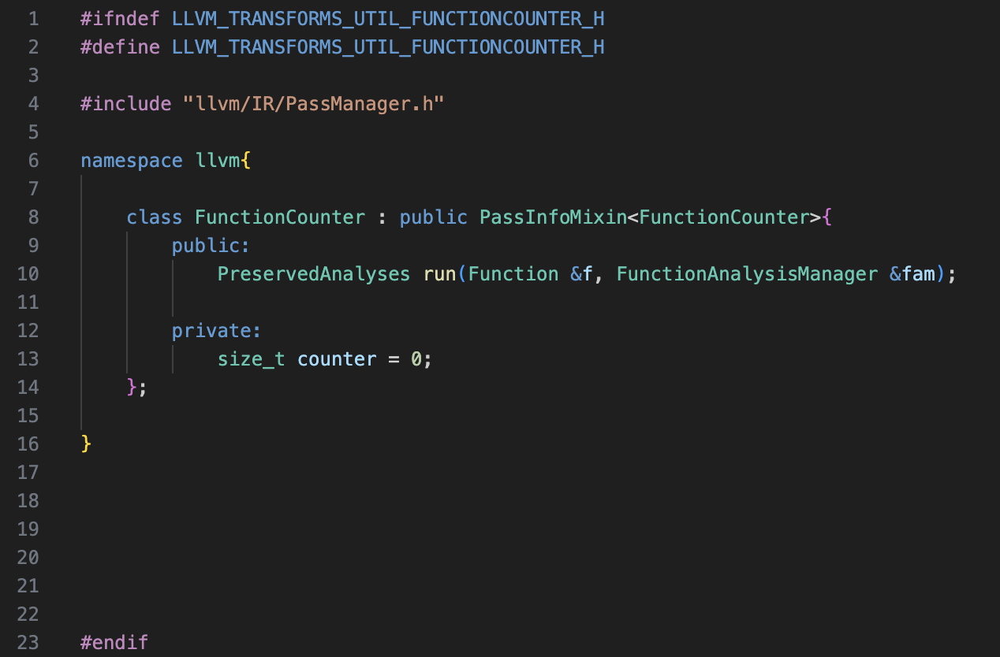
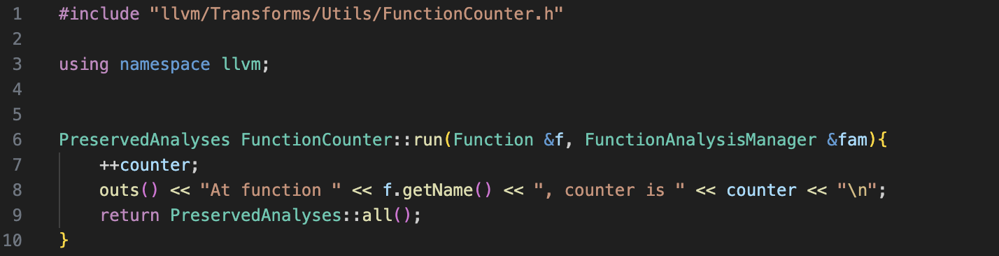
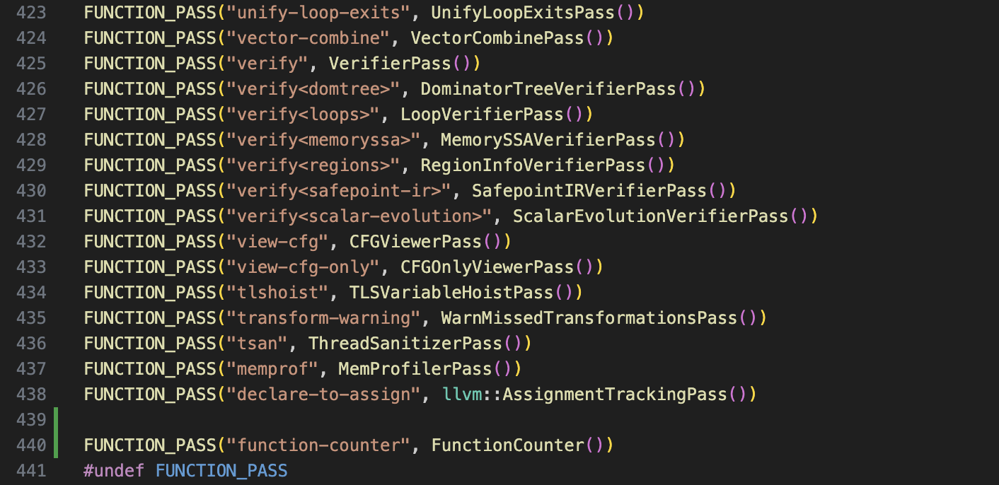

# How to use analysis result with new pass manager in LLVM


LLVM has recently moved from legacy pass manager to <a href="https://blog.llvm.org/posts/2021-03-26-the-new-pass-manager/">new pass manager</a>.
However, there are only a few tutotials online that explains how to work with the new pass manager to write a pass. The official tutorials (<a href="https://llvm.org/docs/NewPassManager.html#using-the-new-pass-manager">using the new pass manager</a> and <a href="https://llvm.org/docs/WritingAnLLVMNewPMPass.html#writing-an-llvm-pass">writing an llvm pass</a>) from LLVM gives a good start point, but it leaves a big gap for the reader who want to do more
advanced analysis than a "Hello World" pass. In this post, I am going to cover how to use the analysis result by creating two passes - an analysis pass that count how many functions are in this module, and a readout pass that print the analysis result to stdout.

First, let's go over some basic knowledges about writing a pass with new pass manager. The passes for new pass manager are located at ```llvm/lib/Transform/Utils/``` and ```llvm/lib/Transform/```. ```llvm/lib/Transform/``` contains passes that are implemented for both lagacy pass manager and new pass manager. For this post, we will only focus on ```llvm/lib/Transform/Utils/```.


The first step of writing a pass with new pass manager is to create a header file in ```llvm/include/llvm/Tramsforms/Utils``` and a C++ source file in ```llvm/lib/Transform/Utils/```. In our case, will call the pass we are going to create as *FunctionCounter*.

||
|:--:| 
| *llvm/include/llvm/Tramsforms/Utils/FunctionCounter.h* |

||
|:--:| 
| *llvm/lib/Transform/Utils/FunctionCounter.cpp* |


We see that this pass is really simple - everytime it sees a function, it output the function name and the current counter value. Then, it increase the counter value by 1.

To build this pass with new pass manager, there are several files we need to modify.

1. We need to add line ```FUNCTION_PASS("function-counter", FunctionCounter())``` to ```llvm/lib/Passes/PassRegistry.def```. If you do not familar working with large C++ projects, a .def file is typically used as  a central place to store some reusable information. In our case, PassRegistry.def will be included by several .cpp files with different definitions of macro FUNCTION_PASS, so we do not bother ourselves with writing the same thing multiple times and worse - updating multiple places in the future if we need to change the information. But since this is a post about llvm, we are not going to dig into .def files

||
|:--:| 
| *llvm/lib/Transform/Passes/PassRegistry.def* |

2. Next, we go to ```llvm/lib/Passes/PassBuilder.cpp``` and add line ```#include llvm/Transforms/Utils/FunctionCounter.h```

||
|:--:| 
| *llvm/lib/Transform/Passes/PassBuilder.cpp* |

3. Finally, we go to ```llvm/lib/Transforms/Utils/CMakeList.txt``` and add line ```FunctionCounter.cpp```.

||
|:--:| 
| *llvm/lib/Transform/Passes/CMakeList.txt* |


Now let's try to build and run our pass now.
```bash
ninja
```

Assuming you have llvm-17, the build system will detect the change of CMakeList.txt and build the pass for you. Now we are ready to run the pass.
```bash
cd <llvm-dir>/llvm/build/bin
./opt -passes="function-counter" < test.bc --disable-output
```


```llvm

define i32 @main() #0 {
entry:
  %retval = alloca i32, align 4
  %i = alloca i32, align 4
  %a = alloca i32, align 4
  %b = alloca i32, align 4
  %p = alloca ptr, align 8
  store i32 0, ptr %retval, align 4
  store i32 1, ptr %a, align 4
  store i32 2, ptr %b, align 4
  store ptr %i, ptr %p, align 8
  %0 = load i32, ptr %i, align 4
  %tobool = icmp ne i32 %0, 0
  br i1 %tobool, label %if.then, label %if.else

if.then:                                          ; preds = %entry
  store ptr %a, ptr %p, align 8
  br label %if.end

if.else:                                          ; preds = %entry
  store ptr %b, ptr %p, align 8
  br label %if.end

if.end:                                           ; preds = %if.else, %if.then
  %1 = load ptr, ptr %p, align 8
  store i32 3, ptr %1, align 4
  ret i32 0
}
```

Oops! We have nothing as output. But why?

||
|:--:| 
| *PassOutput.png* |

The reason is that by default, *clang* attaches an [optnone](https://clang.llvm.org/docs/AttributeReference.html#optnone) attribute to each function, which means optimizations should not be run on any of these functions. 

To solve this problem, we can either inform *clang* to not attach the optnone attribute during compiling by adding ```-Xclang --disable-O0-optnone``` or make our pass a [required pass](https://llvm.org/docs/WritingAnLLVMNewPMPass.html#id8). Now let's run the pass again.

||
|:--:| 
| *PassOutput.png* |

Great, now we have a running pass that outputs the function names and a counter of functions.

In the next post, we will create a readout pass and see how to use the result of FunctionCounter in our new pass.


<a href="../index.html">Back to homepage</a>


